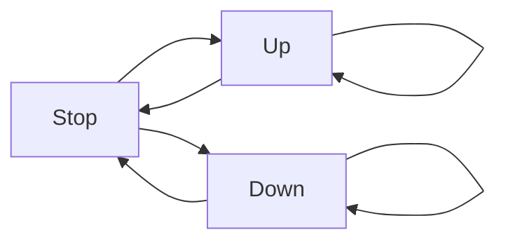

# Non-Blocking Concurrent Rolling Shutters

Rolling shutter motors often come with two inputs: Up and Down.
Typically, these motors come with automatic end stops. So to fully open or close the shutter, the corresponding input has to be on long enough to reach the desired position. For electromechanical reasons, directly switching direction is not recommended. A pause of ~0.5s is recommended.

The program should be able to control two rolling shutters, connected to (PD2, PD3) and (PD4, PD5). The inputs are (PC0, PC1) and (PC2, PC5) respectively.

## Tasks

* Create a program that implements the flowchart.
* Extend the flowchart and program to include the pause step.
